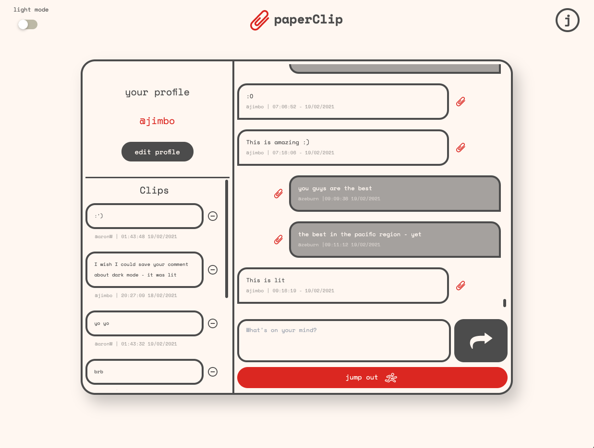
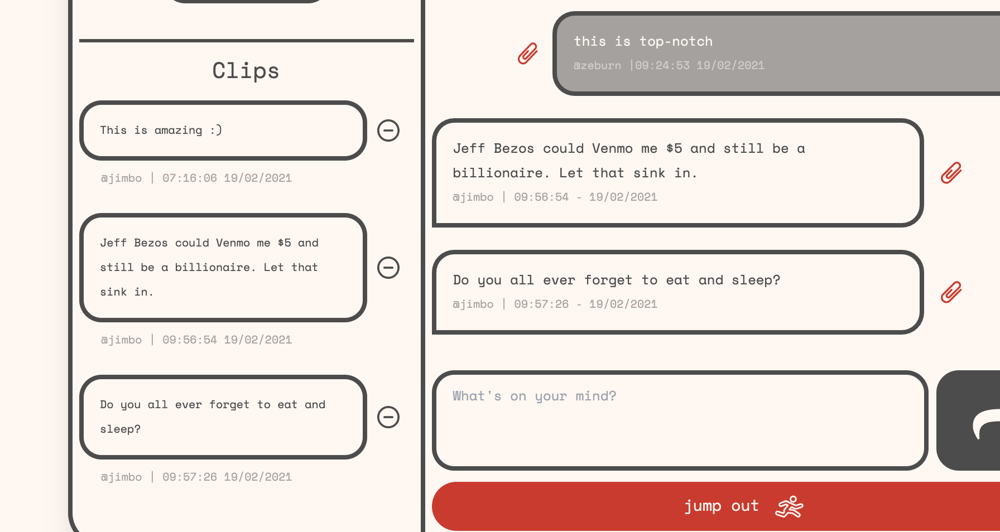
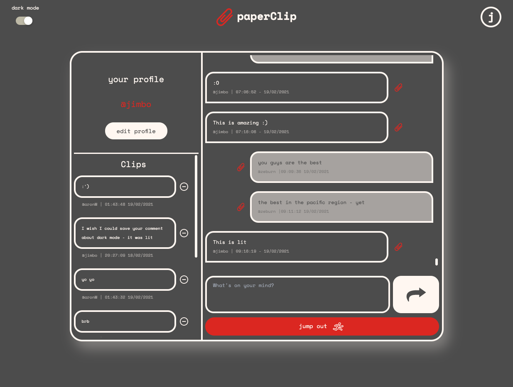

# Welcome to 📎 paperClip!

📎 paperClip is a realtime chat application that will connect you with people around the world, creating real relationships that you can remember through our clip history.

Having fun in your chat? Friend them! Want to remember what they said? Clip it!

Join in on the fun [here](https://justclipit.netlify.app/)!

## Features

### Chat in real time! 💬

Real time chat with the 📎 paperClip community.

---

## Clip user messages 📎

Clip user messages that you like on your own clipboard by simply clicking the 📎 next to a message.

---

### Dark / Light Mode 🌚🌝

Chat in light or dark mode!

---

## Technical breakdown

📎 paperClip was built using React for the frontend and Ruby on Rails for the backend. The backend is hosted on Heroku with the frontend residing on Netlify.

Link to backend [here](https://github.com/AndreAnggono/paperClip-backend/).

### Models

It combines and relates user, chat, message and clip models.

### Extensions, Gems and Packages

We utilised Rails core gems alongside Rails Same Site Cookie and for the frontend made use of Axios, Styled Components, Underscore, React Scripts and web Vitals.

Also a huge thank you to DinosoftLabs, Scott Desmond, iconsmind.com, i cons, Zach Bogart, GraphiteSword, Phoenix Dungeon for the amazing icons we used on this project courtesy of [The Noun Project](https://thenounproject.com/).

## Credits

Brought to you by:

- Andre Anggono
- Jim Carlton
- Zoha Fard
- Aron Weston

Special thank you to Joel, Stacey and Guillaume in the GA crew for helping us through the build for this project!
